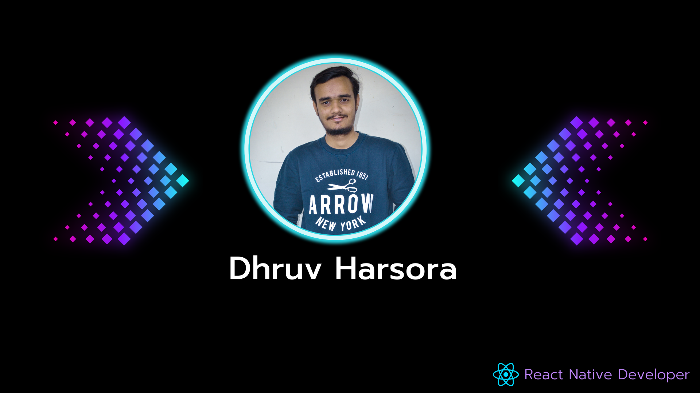

# Hey 👋, I'm Dhruv Harsora

### **👨🏻‍💻 About Me**

- 🌱 I'm a professional mobile app developer.
- 💬 My experience includes developing React Native applications that are both highly performant and scalable, using native APIs to create deep integrations with both mobile platforms. I am proficient in building digital solutions with react components, responsive design, and cross-browser capability. My understanding of design patterns, mobile architectures, and engineering practices is excellent. Furthermore, I have experience writing quality code with unit tests and maintaining it by fixing bugs, performance, and security-related issues.
- 👯 Currently working with React-Native and Android using Kotlin.
- 👀 Interested to develop new things and accept challenges.
- 📫 How to find me:
  - You can shoot me an email at harsoradhruv@gmail.com I'll respond as soon as I can.
  - Connect with me on [LinkedIn](https://in.linkedin.com/in/dhruv-harsora-7792b3148)

### **🛠 Expert in Tech Stack**

                          

### **🔭 Known in Tech Stack**

                  

### **✍🏻 Blog**

<a target="_blank" href="https://medium.com/simform-engineering/manage-dark-mode-in-react-native-application-2a04ba7e76d0"></img></a>  

### **📖 Open Source**

<a target="_blank" href="https://www.npmjs.com/package/react-native-swippable-modal?activeTab=readme"></img></a>  

### **🤝 Connect with me**

<!--
**DhruvHarsora-FullStackDeveloper/DhruvHarsora-FullStackDeveloper** is a ✨ _special_ ✨ repository because its `README.md` (this file) appears on your GitHub profile.

Here are some ideas to get you started:

- 🔭 I’m currently working on ...
- 🌱 I’m currently learning ...
- 👯 I’m looking to collaborate on ...
- 🤔 I’m looking for help with ...
- 💬 Ask me about ...
- 📫 How to reach me: ...
- 😄 Pronouns: ...
- ⚡ Fun fact: ...
-->
